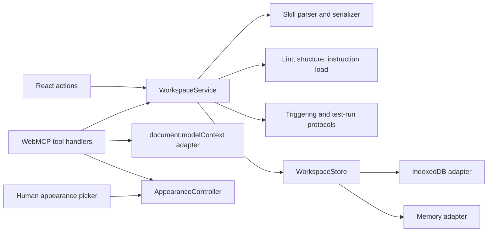
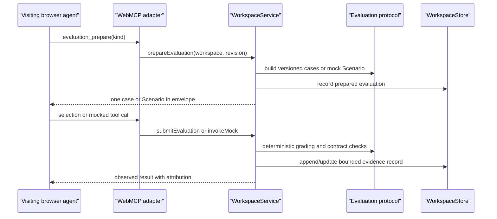

# Skill Canvas architecture

## Product boundary

Skill Canvas is a static, deployable browser workbench built around a legibility problem: Skills are behaviorally important but operationally invisible. This is most acute for imported and default Skills, where a user may not know what instructions exist, when they apply, or whether they are well formed. The workbench provides several complementary views—rendered intent, structural anatomy, Source-spans, lint, instruction load, observed evaluations, and revision comparison—so a user can understand, judge, and improve a Skill without reducing it to one score.

The visiting browser agent is the inference engine and Skill author. The site provides visible deterministic state, validation, mock worlds, evidence capture, grading, revision comparison, and evidence-free JSON export. Human UI remains complete without WebMCP.

## Module graph



Dependencies point inward. React, `document.modelContext`, downloads, browser storage, and IndexedDB are outer mechanisms. Domain operations depend on `WorkspaceService`/`WorkspaceStore` interfaces rather than browser globals. The memory adapter is the contract-test and explicit ephemeral implementation.

## Workspace interface

`WorkspaceStore` covers:

- create/open/list workspace;
- append revision with `baseRevision` conflict detection;
- put/recompute artifact;
- record evaluation evidence;
- append audit event;
- import/export a bounded versioned snapshot.

The IndexedDB schema is versioned. Separate object stores hold workspaces, revisions, byte-exact blobs, artifacts, evaluation records, and audit events. Immutable Skill/reference content is SHA-256-addressed and deduplicated without normalizing line endings. Revision records point to a Skill blob and normalized reference pointers. Evaluation writes measure the transaction's merged workspace snapshot before commit, so concurrent tabs cannot exceed the portable budget with individually valid records. Comparison writes atomically replace any prior comparison across the workspace. The welcome screen discovers saved workspaces through the store's list operation; the current-workspace id is only a session convenience in `sessionStorage`. Theme/view are the only small `localStorage` preferences.

Every mutation that changes Skill content takes a base revision. A stale mutation returns:

```json
{
  "code": "revision_conflict",
  "message": "The workspace changed after this edit began.",
  "details": {
    "expectedBaseRevision": 3,
    "receivedBaseRevision": 2
  }
}
```

No mutation overwrites a revision. Reversal means appending another revision.

## Analysis artifacts

Lint and structure are deterministic analysis capabilities. Findings carry stable rule id, severity, message, optional Source-span, score, grade, counts, and ruleset version. Clicking a finding changes to Source view and selects its character range.

Instruction decomposition is different: the visiting agent submits atomic requirements with an exact Source-span, normalized statement, kind, scope, dependency references, and verifiability. Browser code validates spans, ids, references, and cycles. The persisted map is restored with its revision and rendered as an accessible requirement/dependency list. The record remains labelled `visiting-agent proposal`; acceptance is an explicit human/workflow action.

Accepted maps yield an instruction-load vector, never a semantic count inferred from tokens, bullets, or imperative regexes:

- total atomic requirements;
- maximum simultaneously active requirements on a path;
- longest dependency chain;
- maximum scope depth;
- branch count;
- cross-scope references;
- conflicts;
- duplicates;
- deterministically verifiable fraction.

No model-independent capacity number is claimed. A capacity-probe record shape/version exists in the domain vocabulary, but execution is deferred until the accepted-map UX is proven.

## Agent-mediated evaluation sequence



Triggering cases are pinned to prompt-battery, distractor-library, ruleset, revision, and content hash. A choice and rationale are agent-supplied; whether the choice matches fire/silent is deterministic.

A test run has one Tool contract, deterministic schema-derived fixture, run-scoped mock registration, visible transcript, optional Response schema, and final-output checks. Nothing imported or real is executed. If native dynamic registration is absent, the same protocol runs through the visible manual invocation path and reports that limitation.

## WebMCP seam and envelopes

The native surface is isolated in `webmcp.ts`. It feature-detects only `document.modelContext`, registers current-draft imperative tools asynchronously, and aborts registrations during cleanup. Native schema validation, output schemas, streaming, and progress are not assumed.

Every tool returns one JSON-compatible envelope:

```ts
type ToolEnvelope<T> = {
  protocolVersion: "skill-canvas/1";
  ok: boolean;
  workspaceId: string | null;
  revision: number | null;
  contentHash: string | null;
  data?: T;
  error?: DomainError;
};
```

Deterministic artifacts and agent-supplied judgments occupy separate fields/records. `skill_read` and appearance reads are side-effect-free. Analysis and comparison deliberately persist traceable artifacts, so those tools are not annotated read-only; neither appends a Skill revision.

## Appearance seam

`AppearanceController` owns `readState()` and `setChoice(choice)`. React and WebMCP never write document attributes or storage directly. One registry includes system, light, dark, tuxedo, cardigan, and terminal plus semantic/look tokens. System mode follows later `prefers-color-scheme` changes; explicit modes do not. One event updates all subscribers.

Appearance is a browser preference, not workspace content. It is excluded from revisioning, hashes, evaluation evidence, and snapshots.

## Import, export, and trust limits

Skill/reference imports preflight file counts and byte sizes before reading, require byte-exact UTF-8 without a byte-order mark, and reject absolute or traversal paths, duplicate normalized paths, too many files, and excessive byte sizes. Imported content is never executed. Snapshot import additionally enforces a global byte limit, schema version, canonical record identities, blob hash/size integrity, and linear revision lineage.

The portable format is one JSON workbench snapshot containing Skill content, reference paths, revisions, maps, and audit events. Export omits evaluation and comparison evidence, and admission rejects snapshots containing it; those deterministic results must be regenerated locally after import.

## Deferred scope

- accounts, remote persistence, collaboration, teams, publishing;
- provider keys, model gateway/router, usage accounting, hosted inference;
- whole-agent configurations and runnable code;
- semantic decomposition performed or endorsed by the site;
- model-generated batteries/Insights and runtime portability claims;
- a capacity-probe UI and experimental pressure scalar;
- full JSON Schema and syntax-aware source diffing.
